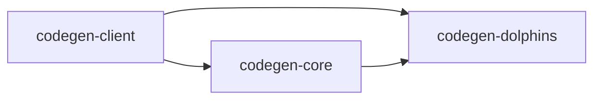

# 描述
这个工具的目标是提供一套基本的生成框架。这个框架只做基本的架构提供，而具体的实现方式需要自己构建。由于框架只提供基本的架构，所以具有超高自由度，同时带来的问题就是集成度不够，很多代码需要自行实现，但是这点并不影响这个工具为生成所带来的便捷性。

# 架构

### 模块
整个工具的架构分成三个模块，下面简述三个模块的用途：
* **codegen-client**，这个模块是让用户自行实现所需要的生成代码，其中需要实现的内容包括：engine、factory、domain，例如：要生成一个特定的html文件，就把相应的engine、factory、domain实现好就可以了。
* **codegen-core**，这个模块是整个框架的核心，但实质上真正的代码量并不多，仅仅是提供一个清晰的架构，方便后面的开发。核心代码就只有三个类：BaseEngine、BaseFactory、BaseDomain，后面的开发也是围绕着这三个类去做。
* **codegen-Dolphins**，这个模块是将数据库中的表实例化成对象，方便后面在生成代码时用到实例化后的表对象。

### 依赖关系
模块间的依赖关系：


### 设计
整个框架的设计是以工厂模式为基础的，并以此进行进一步的拓展，所以整个框架的核心就是三个base类：BaseDomain、BaseEngine、BaseFactory。

而在一般的工厂模式中是不存在engine这个类的，仅仅是由domain和factory两者来组成。这里添加engine这个类是考虑以下情景：当数据和生成的文件相同，使用的模板文件不同时，就需要用到不同的engine。例如：生成同一个html文件，但模板文件可以使用velocity或freemaker写，这时候就需要按照模板使用不同的生成方式。

Domain、Factory和Engine类分别的责任：
* Domain负责封装数据
* Factory负责将BaseDomain转化成真正的data
* Engine负责决定最后data和模板文件如何结合

# 使用
具体使用可参考生成`pet.html`的相关代码

继承BaseDomain的代码
```java
public class Pet extends BaseDomain{
    String name;
    String price;

    public Pet(String name, String price) {
        this.name = name;
        this.price = price;
    }

    public String getName() {
        return name;
    }

    public void setName(String name) {
        this.name = name;
    }

    public String getPrice() {
        return price;
    }

    public void setPrice(String price) {
        this.price = price;
    }
}
```

继承BaseFactory的代码
```java
public class PetFactory extends BaseFactory {

    public PetFactory(BaseEngine baseEngine) {
        super(baseEngine);
    }

    @Override
    public void getDataFromDomain(BaseDomain... baseDomain) {
        data = new HashMap();
        data.put("petList", baseDomain);
    }

}
```

测试代码
```java
@Test
public void petHtml(){
    //destFile
    File fileDir = new File("hellworld");

    if (!fileDir.exists()){
        fileDir.mkdir();
    }

    List<Pet> petList = new ArrayList<>();
    petList.add(new Pet("horse" , "00.00"));
    petList.add(new Pet("dog" , "9.99"));
    petList.add(new Pet("bear" , ".99"));

    File destFile = new File(fileDir.getAbsolutePath() + "\\pet.html");

    try{
        PetFactory petFactory = new PetFactory(new VelocityTemplateEngine("pet"));
        petFactory.getDataFromDomain(petList.stream().toArray(Pet[]::new));
        petFactory.generateSingleTemplates("pet.html", destFile.getAbsolutePath());

    } catch (EngineException e){
        logger.error(e.getMessage());
    }
}
```
